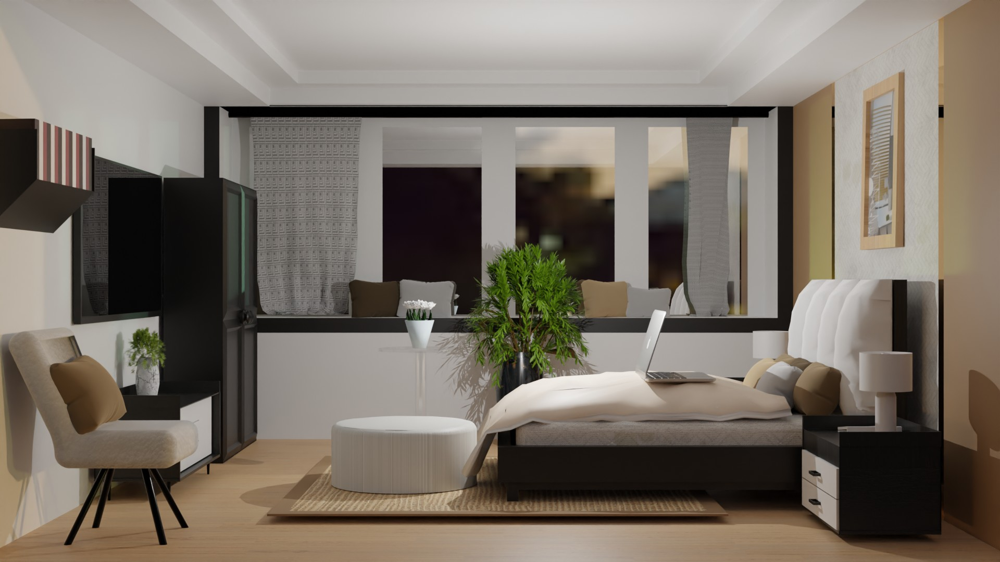

# 3D Room Design Project

This project is a 3D room design application built with React and Three.js. It allows users to visualize furniture and decor in a room to help with interior design planning.

## Installation

1. Clone the repository:

   git clone https://github.com/Pawan8620/3D-Room-Design.git

2. Navigate to the project directory:

   cd 3D-Room-Design

3. Install dependencies:

   npm install

## Usage

To start the development server:

npm start

This will open the application in your browser at `http://localhost:3000`.

## Contributing

Contributions are welcome! Please fork the repository and submit a pull request with your changes.
